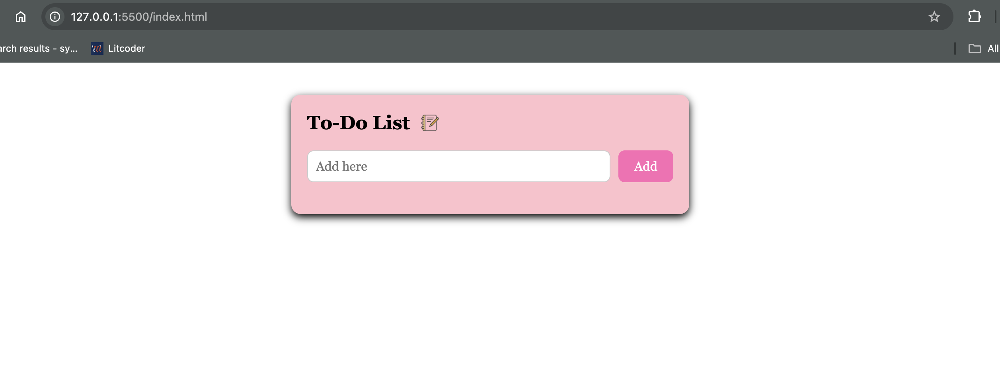
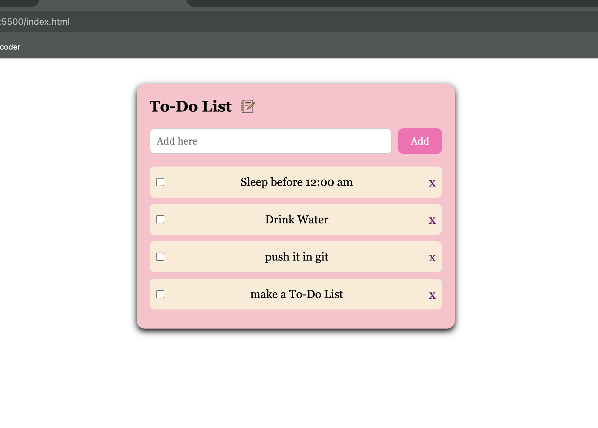
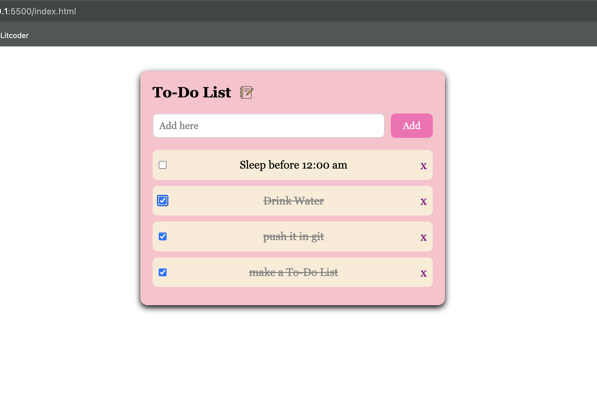

# 📝 To-Do List Web App

A simple and clean To-Do List application built using **HTML**, **CSS**, and **JavaScript**. It allows users to add, delete, and manage tasks with an attractive UI and smooth user experience.

---

## 🚀 Features

- ✅ Add new tasks  
- ❌ Delete tasks  
- 📋 New tasks appear at the top  
- 🎨 Styled with custom CSS for a soft and clean UI  

---

## 📸 Preview

Here are some screenshots of the app:








---

## 💻 Technologies Used

- HTML5  
- CSS3  
- JavaScript (Vanilla)

---

## 📂 How to Use

1. Clone the repository:

```bash
git clone https://github.com/sy7258/your-repo-name.git

2. Open index.html in your browser.

3. Start adding your tasks!

## 📌 Project Structure
├── index.html
├── styles.css
├── first.js
├── screenshot1.png  
├── screenshot2.png 
├── screenshot3.png 
└── README.md


## 🙌 Acknowledgments
Made with 💖 for learning and fun!

## ✨ Author
sy7258
https://github.com/sy7258

